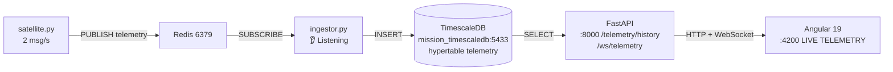

# 🛰️ NASA MISSION CONTROL TELEMETRY

> **SAT-01 | TimescaleDB + Redis + FastAPI + Angular 19**
> Pipeline em tempo real: `satellite.py (2msg/s) → Redis → ingestor.py → mission_control (hypertable) → FastAPI → Angular`

[Status](https://img.shields.io/badge/status-LIVE%20(162%20packets)-brightgreen)
[Stack](https://img.shields.io/badge/stack-TimescaleDB%2BRedis%2BFastAPI%2BAngular%2019-blue)
[Python](https://img.shields.io/badge/python-3.12-yellow)
[License](https://img.shields.io/badge/license-MIT-black)

---

## 🖥️ Preview

```
🛰️ NASA MISSION CONTROL TELEMETRY
SAT-01 | TimescaleDB + Redis + FastAPI + Angular 19

LIVE TELEMETRY (162 packets ingested)

TIMESTAMP: 2026-10-05T15:29:16.334678
BATTERY: 69.81% NOMINAL
TEMPERATURE: 28.08°C
ALTITUDE: 436.6 km
SIGNAL: 81.66%
SAT_ID: SAT-01
```

API: `GET /telemetry/history?limit=8` → JSON real da hypertable.

---

## 🏗️ Arquitetura



**Tabela:**
```sql
Table "public.telemetry"
  timestamp | timestamp without time zone | PK
  sat_id    | varchar
  battery   | double precision
  temperature | double precision
  altitude  | double precision
  signal    | double precision
Indexes: telemetry_timestamp_idx DESC
```

---

## 🚀 Quick Start (Windows - corrigido)

### 1. Subir infra
```powershell
docker-compose up -d
docker ps
# 0.0.0.0:5433->5432/tcp  mission_timescaledb
# 0.0.0.0:6379->6379/tcp  mission_redis
```

> **Importante:** Projeto usa `5433:5432` para não conflitar com Postgres local na 5432. Todo `DATABASE_URL` deve ser `localhost:5433`.

### 2. Backend (3 terminais)
```powershell
# Terminal 1 - Ingestor
cd backend
.env\Scripts\Activate.ps1
python -m app.ingestor
# 👂 Listening + 💾 Saved: SAT-01 battery=...

# Terminal 2 - Simulador
cd simulator
..ackendenv\Scripts\Activate.ps1
python satellite.py
# 🛰️ publishing 2msg/s

# Terminal 3 - FastAPI
cd backend
.env\Scripts\Activate.ps1
uvicorn app.main:app --reload --port 8000
# http://127.0.0.1:8000/docs
# http://127.0.0.1:8000/telemetry/history?limit=8
```

### 3. Frontend
```powershell
cd frontend
npm install
ng serve --port 4200
# http://localhost:4200 → LIVE TELEMETRY
```

### 4. Validar
```powershell
docker exec -it mission_timescaledb psql -U postgres -d mission_control -c "SELECT COUNT(*) FROM telemetry;"
# count: 35 → 162 → 500+ (crescendo)
```

---

## 🐛 Troubleshooting - 7 bugs corrigidos nesta missão

| Erro | Causa | Fix |
|------|-------|-----|
| `Node 24 Unsupported` | Angular 19 precisa Node 20/22 | `nvm use 20` |
| `ssr.entry required` | Angular SSR habilitado sem server | `ng serve` sem SSR ou `angular.json` sem ssr |
| `WinError 1225 ConnectionRefused 5432` | `docker-compose.yml` mapeia `5433:5432` | Trocar `DATABASE_URL` para `localhost:5433` |
| `column "time" does not exist` | Tabela usa `timestamp` | `INSERT INTO telemetry (timestamp, ...)` |
| `can't subtract offset-naive and offset-aware` | Coluna `timestamp without time zone` + datetime com `tzinfo` | `timestamp.replace(tzinfo=None)` |
| `ImportError connected_clients` | `main.py` importava do `ingestor.py` simples | Definir `connected_clients = set()` no `main.py` |
| `rootDir must be explicitly set` | Angular 19 + `tsconfig.json` sem rootDir | Adicionar `"rootDir": "./src"` |

---

## 📦 Stack

- **DB:** TimescaleDB 15 (hypertable) + Redis 7
- **Backend:** Python 3.12, FastAPI, SQLAlchemy async, asyncpg, redis.asyncio
- **Frontend:** Angular 19, TypeScript 5, RxJS WebSocket
- **Infra:** Docker, docker-compose
- **Simulador:** `satellite.py` gera `battery, temperature, altitude, signal` a 2Hz

---

## 📂 Estrutura

```
nasa-mission-control-telemetry/
├── docker-compose.yml (5433:5432, 6379:6379)
├── backend/
│   ├── app/
│   │   ├── main.py (FastAPI + /telemetry/history + /ws)
│   │   ├── ingestor.py (Redis → TimescaleDB)
│   │   ├── database.py (DATABASE_URL 5433)
│   │   └── models.py
│   └── venv/
├── simulator/
│   └── satellite.py
└── frontend/
    ├── src/app/ (telemetry live component)
    └── tsconfig.json (rootDir: ./src)
```

---

## 🔜 Próximos passos

- [ ] Grafana dashboard para bateria/temperatura
- [ ] Alertas `battery < 20%` via Redis Pub/Sub
- [ ] Múltiplos satélites `SAT-02, SAT-03`
- [ ] Hypertable compression + retention policy TimescaleDB
- [ ] Deploy com `Timescale Cloud + Fly.io`

---

**Feito por Jairo Andrade** - de `TypeError: 'str' object` e `COUNT 35 travado` para `LIVE TELEMETRY 162 packets`